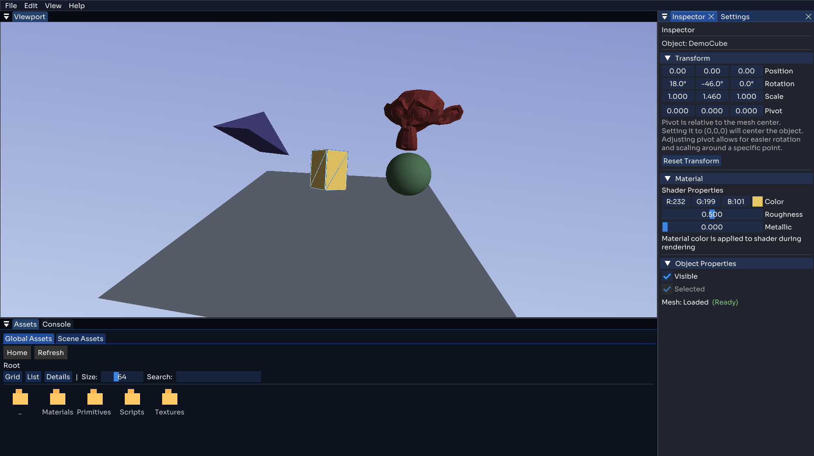

# Voltray

A modern, cross-platform C++ real-time rendering engine with an integrated editor. Voltray is a comprehensive 3D graphics engine designed for learning, experimentation, and educational purposes, featuring clean architecture, extensible design, and professional-grade development practices.



<div align="center">


</div>

---

## Features

### **Real-Time 3D Rendering**
- **OpenGL 4.6 Pipeline**: Modern graphics API with advanced shader support
- **Mesh Rendering System**: Efficient vertex array and buffer management
- **Material System**: Customizable materials with uniform color support
- **Skybox Rendering**: Immersive environment backgrounds
- **Depth Testing**: Proper z-buffer management for 3D scenes

### **Integrated Editor**
- **Live Viewport**: Real-time 3D scene editing and visualization
- **Dockable Interface**: Flexible ImGui-based workspace with drag-and-drop panels
- **Inspector Panel**: Object property editing (transform, materials, visibility)
- **Asset Browser**: Resource management and file organization
- **Console System**: Real-time logging and debugging output
- **Settings Panel**: Engine configuration and camera controls

### **Advanced Mathematics**
- **Vector Math**: Comprehensive Vec2, Vec3, Vec4 implementations
- **Matrix Operations**: Full Mat4 with transformations, projections, and inverse
- **Transform System**: Position, rotation, scale with pivot support
- **Ray Casting**: 3D ray intersection testing for object picking
- **Camera System**: Perspective and orthographic projection support

### **Object Selection & Interaction**
- **Mouse Picking**: Ray-based object selection in 3D space
- **Visual Feedback**: Outline rendering for selected objects
- **Transform Manipulation**: Direct object transformation via inspector
- **Scene Hierarchy**: Organized object management and visibility control

### **Robust Architecture**
- **Modular Design**: Clean separation between engine, editor, and utilities
- **RAII Memory Management**: Smart pointers and automatic resource cleanup
- **Event-Driven Input**: Responsive mouse and keyboard handling
- **Resource Management**: Centralized asset loading and path resolution
- **Error Handling**: Comprehensive logging and crash reporting

---

## Project Architecture

Voltray follows a modular architecture with clear separation of concerns:

### Core Systems

**Engine**: The heart of Voltray, containing the graphics pipeline, scene management, input handling, and mathematical frameworks. All rendering operations, from basic mesh drawing to advanced camera systems, are managed here.

**Editor**: A comprehensive visual interface built on ImGui, featuring a real-time viewport, dockable panels, and intuitive tools for scene editing. The editor provides seamless integration between 3D visualization and property manipulation.

**Mathematics**: A robust linear algebra library supporting vectors, matrices, transformations, and ray casting. Optimized for graphics programming with SIMD-friendly operations and comprehensive intersection testing.

**Utilities**: Supporting systems including resource management, crash logging, and path resolution utilities that ensure reliable operation across different platforms.

### Key Components

#### **Graphics Pipeline**
- **Renderer**: Central rendering coordinator managing draw calls
- **Mesh System**: Vertex/index buffer abstraction with attribute layout
- **Shader Management**: GLSL program compilation, linking, and uniform handling
- **Framebuffer Operations**: Off-screen rendering for editor viewport

#### **Editor System**
- **Viewport**: Real-time 3D scene preview with mouse interaction
- **Panel System**: Modular UI components with save/restore layouts
- **Scene Editing**: Live object manipulation and property modification
- **Resource Browser**: File system integration and asset management

#### **Mathematics Framework**
- **Linear Algebra**: Full vector and matrix mathematical operations
- **Projections**: Perspective and orthographic camera matrices
- **Transformations**: Translation, rotation, scaling with pivot points
- **Intersection Testing**: Ray-sphere, ray-AABB, ray-triangle algorithms

### Development Roadmap
- [ ] **Scene Serialization**: Save/load scenes with object states and properties
- [ ] **Advanced Lighting System**: Implement directional, point, and spot lights
- [ ] **Texture Mapping**: Add support for texture loading and material properties
- [ ] **Post-Processing Effects**: Bloom, SSAO, and other visual enhancements
- [ ] **Physics Integration**: Basic collision detection and response
- [ ] **Animation System**: Basic skeletal animation support

---

## Getting Started

### Prerequisites

Ensure you have the following tools installed:

- **C++17 Compatible Compiler**:
  - Windows: Visual Studio 2019+ or MinGW-w64
  - Linux: GCC 7+ or Clang 6+
  - macOS: Xcode 10+ or Clang 6+
- **[CMake](https://cmake.org/) 3.17+**: Build system generator
- **[Git](https://git-scm.com/)**: Version control system
- **[Doxygen](https://www.doxygen.nl/)**: API documentation generation (optional)

### Quick Build

**Windows:**
```cmd
git clone https://github.com/MomdAli/Voltray.git
cd Voltray
./build.bat
```

**Linux/macOS:**
```bash
git clone https://github.com/MomdAli/Voltray.git
cd Voltray
chmod +x build.sh
./build.sh
```

**Docker (Cross-Platform):**
```bash
git clone https://github.com/MomdAli/Voltray.git
cd Voltray
# Windows
docker-build.bat
# Linux/macOS
./docker-build.sh
```

> 📋 **Docker Development**: For comprehensive Docker setup including development environment, see [`docs/DOCKER.md`](docs/DOCKER.md)

### Manual Build

For more control over the build process:

```bash
# Clone repository
git clone https://github.com/MomdAli/Voltray.git
cd Voltray

# Create build directory
mkdir build && cd build

# Configure CMake (Debug)
cmake .. -DCMAKE_BUILD_TYPE=Debug

# Or configure for Release
cmake .. -DCMAKE_BUILD_TYPE=Release

# Build the project
cmake --build . --config Release

# Run the executable
# Windows
.\Release\Voltray.exe
# Linux/macOS
./Voltray
```

### Dependencies

Voltray automatically manages its dependencies via CMake FetchContent:

| Library | Version | Purpose |
|---------|---------|---------|
| **[GLFW](https://glfw.org/)** | Latest | Window management and input |
| **[GLAD](https://glad.dav1d.de/)** | v2.0.8 | OpenGL function loading |
| **[ImGui](https://github.com/ocornut/imgui)** | Docking branch | Editor user interface |
| **[Assimp](https://assimp.org/)** | Latest | 3D model loading |
| **[stb_image](https://github.com/nothings/stb)** | Latest | Image loading |

---

## Usage

### Running the Editor

After building, launch the Voltray editor:

**Windows:**
```cmd
cd build\Release
Voltray.exe
```

**Linux/macOS:**
```bash
cd build
./Voltray
```

### Editor Interface

The editor provides several key panels:

- **🎥 Viewport**: Interactive 3D scene view with mouse controls
  - **Mouse Middle Click + Drag**: Orbit camera around target
  - **Mouse Wheel**: Zoom in/out
  - **Shift + Mouse Middle Click + Drag**: Pan camera
  - **Arrow Keys or Page Up/Down**: Pane Camera
  - **Left Click Object**: Select object for editing

- **🔍 Inspector**: Edit selected object properties
  - Transform: Position, rotation, scale
  - Material: Color and rendering properties
  - Visibility: Show/hide objects

- **📁 Assets**: Browse and manage project resources
- **📋 Console**: View engine logs and debug output
- **⚙️ Settings**: Configure engine and camera parameters

### Basic Scene Editing

1. **Object Selection**: Click on objects in the viewport to select them
2. **Transform Objects**: Use the Inspector panel to modify position, rotation, and scale
3. **Material Editing**: Change object colors and material properties
4. **Camera Controls**: Navigate the 3D scene using mouse controls
5. **Visibility Toggle**: Show/hide objects using the Inspector panel

---

## Technical Specifications

### Rendering Features

- **Graphics API**: OpenGL 4.6 Core Profile
- **Shader Language**: GLSL 460
- **Mesh Format**: Indexed triangles with position, normal, and UV attributes
- **Projection Types**: Perspective and orthographic cameras
- **Culling**: Back-face culling for performance optimization
- **Depth Testing**: Z-buffer with configurable near/far planes

### Performance Characteristics

- **Batch Rendering**: Efficient draw call minimization
- **Immediate Mode UI**: Real-time interface updates
- **Resource Caching**: Smart pointer-based memory management
- **Optimized Math**: SIMD-friendly vector and matrix operations

### Platform Support

| Platform | Status | Compiler | Notes |
|----------|--------|----------|-------|
| Windows 10/11 | ✅ Full | MSVC 2019+ | Primary development platform |
| Ubuntu 20.04+ | ✅ Full | GCC 9+ | Tested on LTS releases |
| macOS 10.15+ | ✅ Full | Clang 12+ | Intel and Apple Silicon |

---

## API Reference

### Core Classes

#### **Renderer**
```cpp
class Renderer {
public:
    void Draw(const Mesh& mesh, const Shader& shader) const;
    void Draw(const Mesh& mesh, const Shader& shader, const Mat4& modelMatrix) const;
};
```

#### **Scene Management**
```cpp
class Scene {
public:
    void AddObject(std::shared_ptr<SceneObject> object);
    void RemoveObject(std::shared_ptr<SceneObject> object);
    void Render(Renderer& renderer, const BaseCamera& camera, Shader& shader);
    std::shared_ptr<SceneObject> GetSelectedObject() const;
};
```

#### **Transform System**
```cpp
class Transform {
public:
    void SetPosition(const Vec3& position);
    void SetRotation(const Vec3& rotation);  // Euler angles in degrees
    void SetScale(const Vec3& scale);
    Mat4 GetMatrix() const;                  // Combined transformation matrix
    Mat4 GetInverseMatrix() const;
};
```

### Documentation

- **Doxygen API Docs**: Comprehensive class and function documentation
- **Generated Documentation**: Available in the `docs/` directory
- **Online Documentation**: [View Documentation](https://MomdAli.github.io/Voltray/)

To generate documentation locally:
```bash
# Using CMake target
cmake --build . --target voltray-docs

# Or directly with Doxygen
doxygen Doxyfile
```

To view the generated documentation click --> [here](https://MomdAli.github.io/Voltray/).

---

## Development

### Building from Source

1. **Fork and Clone**: Create your own fork of the repository
2. **Create Feature Branch**: `git checkout -b feature/your-feature-name`
3. **Make Changes**: Implement your feature or fix
4. **Test**: Ensure all existing functionality works
5. **Commit**: Use clear, descriptive commit messages
6. **Push**: `git push origin feature/your-feature-name`
7. **Pull Request**: Submit PR with detailed description

### Code Style

Voltray embraces **clarity over cleverness** with these core principles:

- **Graphics-First Naming**: `Renderer`, `Mesh`, `Shader` - clear intent over abbreviations
- **RAII Everything**: Smart pointers and stack allocation eliminate manual memory management
- **Const by Default**: Immutability unless mutation is explicitly needed

### Testing

Run the test suite to verify your changes:

```bash
# Build and run tests
cd build
cmake --build . --target RayTests
./RayTests
```

### Adding New Features

When adding new functionality:

1. **Design First**: Consider how it fits into the existing architecture
2. **Document**: Add Doxygen comments for public APIs
3. **Test**: Include unit tests for new functionality
4. **Example**: Update examples or documentation as needed

---

## Contributing

We welcome contributions from developers of all skill levels! Here's how you can help:

### Ways to Contribute

- **Bug Reports**: Found an issue? Report it with detailed reproduction steps
- **Feature Requests**: Suggest new functionality or improvements
- **Documentation**: Improve README, code comments, or API documentation
- **Testing**: Help test on different platforms or configurations
- **Code**: Implement new features or fix existing bugs

### Contribution Guidelines

1. **Read the Code**: Familiarize yourself with the existing codebase
2. **Start Small**: Begin with small, focused changes
3. **Discuss First**: Open an issue to discuss major changes before implementing
4. **Follow Style**: Adhere to the project's coding standards
5. **Test Thoroughly**: Ensure your changes don't break existing functionality

### Getting Help

- **Issues**: Open a GitHub issue for bugs or feature requests
- **Discussions**: Use GitHub Discussions for questions and ideas
- **Documentation**: Check the API documentation for technical details

---

## License

This project is licensed under the **Apache License 2.0**. See the [LICENSE](LICENSE) file for full details.

### What this means:
- ✅ **Free to use** for personal and commercial projects
- ✅ **Modify and distribute** with attribution
- ✅ **Private use** allowed
- ✅ **Patent grant** included
- ❗ **Must include** copyright notice and license
- ❗ **No warranty** provided

**TL;DR**: Do whatever you want with this code, just don't sue me and give credit where it's due!

---

## Acknowledgments

Special thanks to:

- **[OpenGL Community](https://opengl.org/)** - For comprehensive graphics programming resources
- **[Dear ImGui](https://github.com/ocornut/imgui)** - For the excellent immediate mode GUI framework
- **[GLFW Team](https://glfw.org/)** - For cross-platform window and input management
- **[Assimp Contributors](https://assimp.org/)** - For the robust 3D model loading library
- **[LearnOpenGL](https://learnopengl.com/)** - For excellent graphics programming tutorials
- **Open Source Community** - For tools, libraries, and inspiration

---

## Project Status

**Current Version**: Active Development
**Stability**: Beta - Core features implemented and stable

### Recent Updates
- ✅ Simplified namespace architecture for improved code organization
- ✅ Complete editor interface with dockable panels
- ✅ Ray-based object selection and manipulation
- ✅ Comprehensive math library with full Vec/Mat support
- ✅ Multi-camera system (perspective/orthographic)
- ✅ Material system with custom colors
- ✅ Skybox rendering and outline effects
- ✅ Enhanced asset browser with improved navigation
- ✅ Streamlined type system and reduced namespace complexity

---

<div align="center">

**Built with ❤️ for the graphics programming community**

[⭐ Star this project](https://github.com/MomdAli/Voltray) • [🍴 Fork](https://github.com/MomdAli/Voltray/fork) • [🐛 Report Bug](https://github.com/MomdAli/Voltray/issues) • [💡 Request Feature](https://github.com/MomdAli/Voltray/issues)

</div>
