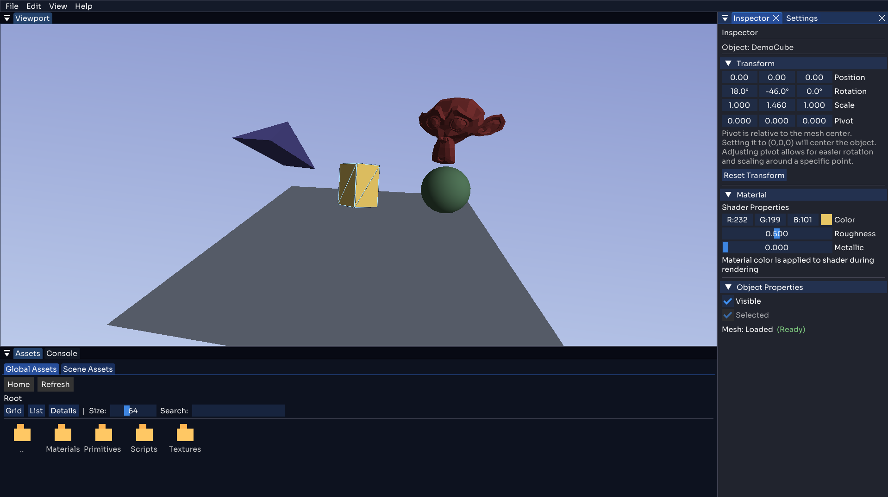

# Voltray

A modern, cross-platform C++ real-time rendering engine with an integrated editor.



<div align="center">


</div>

---

## About

Voltray is a comprehensive 3D graphics engine designed for learning, experimentation, and educational purposes. It features a clean architecture, extensible design, and professional-grade development practices.

## Features

- **Real-Time 3D Rendering**: OpenGL 4.6 pipeline
- **Integrated Editor**: ImGui-based workspace
- **Cross-Platform**: Windows, Linux, macOS Support

## Getting Started

### Prerequisites

- **C++17 Compiler**
  - **Windows**: MSVC (Install "Desktop development with C++" workload via Visual Studio Installer to get `cl.exe`)
  - **Linux**: GCC or Clang (`sudo apt install build-essential clang`)
  - **macOS**: Clang (via Xcode Command Line Tools)
- **CMake 3.17+**
- **Git**

### IDE Setup (VS Code and forks like Cursor)

To get full C++ IntelliSense and debugging working:

1. Install the recommended extensions: **C/C++** (`ms-vscode.cpptools`), **CMake Tools** (`ms-vscode.cmake-tools`), and **CodeLLDB** (`vadimcn.vscode-lldb`).
2. Open the project folder in your IDE.
3. When prompted by CMake Tools, select the appropriate compiler kit (e.g., `Visual Studio Community 2022 Release - ...` on Windows, or `Clang` / `GCC` on Linux).
4. CMake Tools will automatically configure the project and generate the `compile_commands.json` needed for IntelliSense after build.

**Debugging on Windows**:

- For **VS Code**, use the `"Voltray (Windows Debug MSVC)"` launch configuration.
- For **Cursor or Antigravity** (where Microsoft's `cppvsdbg` is unsupported), use the `"Voltray (Windows CodeLLDB)"` launch configuration instead.

### Build Instructions

**Windows**:

```cmd
git clone https://github.com/MomdAli/Voltray.git
cd Voltray
build.bat
```

**Linux/macOS**:

```bash
git clone https://github.com/MomdAli/Voltray.git
cd Voltray
chmod +x build.sh
./build.sh
```

## Usage

### Running the Editor

After building the project, navigate to the `build` directory (or `build\Release` on Windows) and run the `Voltray` executable.

### Basic Controls

- **Orbit Camera**: Middle Mouse Button + Drag
- **Pan Camera**: Shift + Middle Mouse Button + Drag
- **Zoom**: Mouse Wheel
- **Select Object**: Left Click on object in Viewport
- **Transform Object**: Use the **Inspector** panel to modify position, rotation, and scale.

## License

This project is licensed under the **Apache License 2.0**. See the [LICENSE](LICENSE) file for details.

---

<div align="center">

**Built with ❤️ for the graphics programming community**

[⭐ Star this project](https://github.com/MomdAli/Voltray) • [🐛 Report Bug](https://github.com/MomdAli/Voltray/issues)

</div>
